# Génération de fractales

## Description

Ce projet consiste en la création d'un programme en Java permettant de générer quelques fractales. 

- Version de Java : `17.0.4`
- Version de Gradle : `7.3.3`

## Exécution

### A partir des scripts bash

Vous pouvez générer des fractales à l'aide des différents scripts bash présent à la racine du projet. Chaque scripts créé un dossier au nom de la fractale comporte trois images au format `.PNG`. Ces trois images sont trois représentations de la fractale avec différents zooms. La syntaxe pour lancer le script est la suivante :

```sh
./script.sh -p <palette-name>
```

Les différents palettes possibles sont les suivantes :
- `Red` pour une palette de rouge.
- `Green` pour une palette de vert.
- `Blue` pour une palette de bleu.
- `Gray` pour une palette de gris.

Les différents scripts possibles sont les suivants :
- `julia.sh` qui génére la fractale issue de la suite imaginaire avec :
    - `z(0) = z**2 + c` où *z = -0,4 + 0,6i*
    - `z(n+1) = (z(n))**2 + c`
- `julia2.sh` qui génére la fractale issue de la suite imaginaire avec :
    - `z(0) = z**2 + c` où *z = 0,32 + 0,043i*
    - `z(n+1) = (z(n))**2 + c`
- `julia3.sh` qui génére la fractale issue de la suite imaginaire avec :
    - `z(0) = z**2 + c` où *z = -0,0986 - 0,65186i*
    - `z(n+1) = (z(n))**2 + c`
- `julia4.sh` qui génére la fractale issue de la suite imaginaire avec :
    - `z(0) = z**2 + c` où *z = -0,772691322542185 + 0.124281466072787*
    - `z(n+1) = (z(n))**2 + c`
- `general-julia.sh` qui génére la fractale généralisée de Mandelbrot avec :
    - `z(x) = (x**2 + z)/(x**2 + c)`
- `mandelbrot.sh` qui génére la fractale de Mandelbrot.

__Exemple d'exécution :__

```sh
./julia3.sh -p Green
```

On aura, dans le dossier `julia3` les images suivantes :


### A partir du JAR exécutable

Vous pouvez aussi générer des fractales à l'aide du JAR exécutable présent à la racine du projet. Vous pouvez en particulier l'exécuter à l'aide des paramètres suivantes :

```
-f,--fractal-name  <name>      Spécifie le nom de la fractale à générer.
-h,--height        <pixels>    Spécifie la hauteur de l'image à générer.
-n,--nb-iterations <integer>   Spécifie le nombre d'itérations à appliquer pour générer la fractale.
-o,--output        <file>      Spécifie le nom du fichier dans lequel la fractale doit être sauvegardée.
-p,--palette-name  <name>      Spécifie le nom de la palette de couleurs à appliquer lors de la génération.
-s,--scale         <ratio>     Spécifie l'échelle à appliquer sur l'image.
-w,--width         <pixels>    Spécifie la largeur de l'image à générer.
-x,--focus-x       <real>      Spécifie le point central de l'image sur l'axe des abscisses.
-y,--focus-y       <real>      Spécifie le point central de l'image sur l'axe des ordonnées.
```

Vous pouvez aussi exécuter `java -jar fractales-base.jar --help` pour obtenir l'ensemble de ces paramètres.

__Exemples d'utilisation :__

```bash
java -jar fractales-base.jar -f Mandelbrot -h 2048 -n 200 -o mandelbrot-it-200.png -p Blue -s 0.002048 -w 2048 -x 0 -y 0
```
On aura cette image :


```bash
java -jar fractales-base.jar -f Mandelbrot -h 2048 -n 50 -o mandelbrot-it-50.png -p Green -s 0.002048 -w 2048 -x 0 -y 0
```
On aura cette image :


## Diagramme UML

```plantuml
@startuml

package fr.univartois.butinfo.fractals {
    class Fractals
}

class Fractals {
    - help : boolean
    - width : int
    - height : int
    - foxusX : double
    - focusXString : String
    - foxusY : double
    - focusYString : String
    - scale : double
    - scaleString : String
    - fractaleName : String
    - nbIterations : int
    - paletteName : String
    - outputFile : String
    - classParser : ClasseParser<Fractals>
    - Fractals()

    + parseCliArguments(String[]) 
    + usage() : void 
    + buildFractals() : void 
    + {static} main(String[]) : void
}

package fr.univartois.butinfo.fractals.complex {
    class Complex
    class ComplexPlan
    class AdaptateurComplex
    class ComplexPlanTranslationDecorator
    class ComplexPlanZoomDecorator
    abstract class ComplexPlanDecorated
    interface IPlanPoint
    interface IComplex
    interface IComplexPlan
}

abstract class ComplexPlanDecorated {
      + decorated : IComplex
      # height : int
      # width : int

      # ComplexPlanDecorated(height,width)
      + asComplex(int,int) : IComplex;
}

class AdaptateurComplex implements IPlanPoint {
      - complex :IComplex   
    
      + AdaptateurComplex(IComplex)
      + X() : double
      + Y() : double
      + distance(IPlanPoint) : double
      + convertirEnIComplex() : IComplex
}

interface IPlanPoint {
      + X() : double
      + Y() : double
      + distance(IPlanPoint) : double
      + convertirEnIComplex() : IComplex
}

class Complex implements IComplex {
    - re : double
    - im : double 

    + Complexe(double,double)
    + getImaginaryPart() : double
    + abs() : double
    + negate() : IComplex
    + conjugate() : IComplex
    + add(IComplex) : IComplex
    + subtract(IComplex) : IComplex
    + multiply(double) : IComplex
    + multiply(IComplex) : IComplex
    + divide(IComplex) : IComplex
    + equals(Object) : boolean
    + hasCode() : int 
    + toString() : String
}

interface IComplex {
    + getRealPart() : double
    + getImaginaryPart() : double 
    + abs() : double
    + negate() : IComplex
    + conjugate() : IComplex
    + add(IComplex) : IComplex
    + subtract(IComplex) : IComplex
    + multiply(double) : IComplex
    + multiply(IComplex) : IComplex
    + divide(IComplex) : IComplex
}

interface IComplexPlan{
   +  asComplex(int,int) : IComplex;
}

class ComplexPlanZoomDecorator extends ComplexPlanDecorated {
    -  constant : double

    + ComplexPlanZoomDecorator(double)
    + asComplex(int,int) : IComplex
}

class ComplexPlanTranslationDecorator extends ComplexPlanDecorated {
    - constant : IComplex

    + ComplexPlanTranslationDecorator(double)
    + asComplex(int,int) : IComplex
}

class ComplexPlan {
     - height : int
     - width : int 
     +ComplexPlanTranslationDecorator(double,double,height,width)
     + asComplex(int,int) : IComplex
}

package fr.univartois.butinfo.fractals.color {
    class ColorPalette
    interface IColorPaletteStrategy
    abstract class MaskColorPaletteDecorator
}

class  ColorPalette {
    - ITERATION_NUMBER_MAX : int
    - colorPaletteStrategy : IColorPaletteStrategy

    + ColorPalette(int) 
    + getColor(int) : Color
}

interface IColorPaletteStrategy {
    + getColor(int,int) : Color
}

abstract class MaskColorPaletteDecorator implements IColorPaletteStrategy{
   # decorated : IColorPaletteStrategy 

   # MaskColorPaletteDecorator(IColorPaletteStrategy)
}

package fr.univartois.butinfo.fractals.color.strategies {
          class BlueColorPaletteStrategy
          class GrayColorPaletteStrategy
          class GreenColorPaletteStrategy
          class RedColorPaletteStrategy
}

class BlueColorPaletteStrategy implements IColorPaletteStrategy
{
     - {static} TINT_MAX : int
     + getColor(int, int) : Color
}

class GrayColorPaletteStrategy implements IColorPaletteStrategy
{
     - {static final} TINT_MAX : int
     + getColor(int, int) : Color
}

class GreenColorPaletteStrategy implements IColorPaletteStrategy
{
     - {static final} TINT_MAX : int
     + getColor(int, int) : Color
}

class RedColorPaletteStrategy implements IColorPaletteStrategy
{
     - {static final} TINT_MAX : int
     + getColor(int, int) : Color
}

package fr.univartois.butinfo.fractals.color.decorators {
          class OnlyBlueDecorator
          class OnlyGreenDecorator
          class OnlyRedDecorator
}

class OnlyBlueDecorator extends MaskColorPaletteDecorator {
   
    +  OnlyBlueDecorator(IColorPaletteStrategy)
    +  getColor(int, int) : Color
}

class OnlyGreenDecorator extends MaskColorPaletteDecorator {
   
    +  OnlyGreenDecorator(IColorPaletteStrategy)
    +  getColor(int, int) : Color
}

class OnlyRedDecorator extends MaskColorPaletteDecorator {
   
    +  OnlyRedDecorator(IColorPaletteStrategy)
    +  getColor(int, int) : Color
}

package fr.univartois.butinfo.fractals.image {
    class Pixel
    interface IFractalImage
    class BufferedImageAdaptor
    class FractalImage
    class FractalImageBuilder
}

class FractalImageBuilder {
     - height : int
     - width : int
     - scale : double
     - centralPoint : Pixel
     - sequence : Sequence
     - fractalName : String
     - colorPalette : ColorPalette
     - file : String
     - FractalImageBuilder()

     + {static} FractalImageBuilder()
     + getHeight : int
     + withHeight(int) : FractalImageBuilder
     + getWidth() : int
     + withWidth(int) : FractalImageBuilder
     + getScale() : double
     + withScale(double) : FractalImageBuilder
     + getCentralPoint() : Pixel
     + withCentralPoint(Pixel) : FractalImageBuilder
     + getSequence() : String
     + withSequence(String) : FractalImageBuilder
     + getColorPalette() : ColorPalette
     + withColorPalette(ColorPalette) : FractalImageBuilder
     + getFile() : String
     + withFile(String) : FractalImageBuilder
     + build() : FractalImage
}

class FractalImage {
     - height : int
     - width : int
     - scale : double
     - centralPoint : Pixel
     - sequence : Sequence
     - colorPalette : ColorPalette
     - file : String

     + FractalImage(FractalImageBuilder)
     + createImage(int) : void
}

class BufferedImageAdaptor implements IFractalImage {
    - bufferedimage : BufferedImage
    + pixel : Pixel
   
    + BufferedImageAdaptor(BufferedImage)
    + getHeight() : int
    + getWidt() : int
    + getPixel(row,column) : Pixel
    + saveAs(String) : void
    + setColor(Color,row;column) : void
}

class Pixel {
    - image : IFractalImage
    - row : int
    - column : int

    + Pixel(IFractalImage,row,int)
    + getRow() : int
    + getColumn() : int
    + getImage() : IFractalImage
    + setColor(Color) : void
}

interface IFractalImage{
    + getHeight() : int
    + getWidt() : int
    + getPixel(row,column) : int
    + saveAs(String) : void
    + setColor(Color,row;column) : void
}

Pixel o-- "1" IFractalImage
FractalImage o-- "1" Sequence
FractalImageBuilder o-- "1" Sequence
BufferedImageAdaptor o-- "1" Pixel

package fr.univartois.butinfo.fractals.sequences{
    interface INextTerm
    class Sequence
    class SequenceIterator
    class JuliaGeneralizationNextTerm
    class JuliaNextTerm
    class MandelbrotGeneralizationNextTerm
    class MandelbrotNextTerm
}

class JuliaGeneralizationNextTerm implements INextTerm{
     - firstTerm : IComplex
     - presentTerm : IComplex
     - c : IComplex
     - binaryOperator : BinaryOperator<IComplex>
     - sequence : Sequence
     + JuliaGeneralizationNextTerm(IComplex,IComplex, BinaryOperator<IComplex>)
     + calculateNextTerm(IComplex) : IComplex
     + setFirstTerm(IComplex) : void
     + setPresentTerm(IComplex) : void
}

class JuliaNextTerm implements INextTerm {
       + firstTerm : IComplex
       + presentTerm : IComplex
       + z : IComplex
       + c : IComplex
    
       + JuliaNextTerm(IComplex,IComplex)
       + calculateNextTerm(IComplex) : IComplex
       + setFirstTerm(IComplex) : void
       + setPresentTerm(IComplex) : void
       + getPresentTerm() : IComplex      
       + getFirstTerm() : IComplex
}

class MandelbrotGeneralizationNextTerm implements INextTerm {
       - firstTerm : IComplex
       - presentTerm : IComplex
       - z : IComplex
       - sequence : Sequence
       - binaryOperator : BinaryOperator<IComplex>

       + MandelbrotGeneralizationNextTerm(IComplex,IComplex, BinaryOperator<IComplex>)
       + calculateNextTerm(IComplex) : IComplex
       + setFirstTerm(IComplex) : void
       + setPresentTerm(IComplex) : void
       + getPresentTerm() : IComplex      
       + getFirstTerm() : IComplex
}

class MandelbrotNextTerm implements INextTerm {
       - firstTerm : IComplex
       - presentTerm : IComplex
       - z : IComplex
       - sequence : Sequence 

       + MandelbrotNextTerm (IComplex,IComplex)
       + calculateNextTerm(IComplex) : IComplex
       + setFirstTerm(IComplex) : void
       + setPresentTerm(IComplex) : void
       + getPresentTerm() : IComplex      
       + getFirstTerm() : IComplex
}  
     
class Sequence  implements Iterable {
    - nextTerm : INextTerm
    - firstElement : IComplex
    - presentTerm : IComplex

    + getPresentTerm() : IComplex
    + setPresentTerm(IComplex) : void
    + iterator() : Iterator<IComplex>
    + getNextTerm() : INextTerm
    + setNextTerm : void
    + getFirstTerm() : IComplex
    + setFirstTerm(IComplex) : void
}

interface INextTerm {
     + setFirstTerm(IComplex) : void
     + setPresentTerm(IComplex) : void
     + calculateNextTerm(IComplex) : IComplex
     + getPresentTerm() : IComplex
     + getFirstTerm() : IComplex
}

class SequenceIterator implements Iterator {
    - {final} sequence : Sequence
   
    + SequenceIterator(Sequence)
    + hasNext() : boolean
    + next() : IComplex
}

SequenceIterator o-- "1" Sequence
JuliaGeneralizationNextTerm  o-- "1" Sequence
MandelbrotGeneralizationNextTerm o-- "1" Sequence
JuliaNextTerm  o-- "1" Sequence
MandelbrotNextTerm  o-- "1" Sequence
SequenceIterator o-- "1" IComplex
Sequence o-- "1" IComplex

package fr.univartois.butinfo.fractals.sequences.chaotic{
    interface ISequenceChaotique
    class SequenceChaotique
    class SequenceChaotiqueIterator
    class Feigenbaum
    class Circulaire
}

interface ISequenceChaotique {
     + getNext(IPlanPoint) : double
}

abstract class SequenceChaotique implements ISequenceChaotique
abstract class SequenceChaotique implements Iterable {
   - premier : IPlanPoint
   - nbMaxIteration : int
    
   + SequenceChaotique(IPlanPoint, int)
   + iterator() : Iterator<IPlanPoint>
}

class SequenceChaotiqueIterator implements Iterator {
      - precedent: IPlanPoint
      - nbMaxIteration : int
      - nbIteration : int
      - suiteChaotique : ISequenceChaotique
      
      + SequenceChaotiqueIterator(ISequenceChaotique , int, IPlanPoint)
      + hasNext() : boolean
      + next() : boolean 
}

class Feigenbaum extends SequenceChaotique 
class Feigenbaum implements ISequenceChaotique {
     + Feigenbaum(IPlanPoint, int)
     + getNext(IPlanPoint) : double
}

class Circulaire extends SequenceChaotique 
class Circulaire implements ISequenceChaotique {
     + Circualire(IPlanPoint, int)
     + getNext(IPlanPoint) : double
}

package fr.univartois.butinfo.fractals.figure{
    interface IFigure
    class Rectangle
    class Circle
    class Ellipse
    class Polyligne
    class Line
}

interface IFigure {
   + toString() : String
}

class Rectangle implements IFigure{
   - x : int 
   - y : int
   - width : int
   - height : int 
   - rx : int 
   - ry : int
   - fill : String
   - stroke : String
   - strokeWidth : int
   - decorated : IFigure
   
   + Rectangle(int, int, int, int, int, int, String, String, int) 
   + ToString : String
}

class Circle implements IFigure{
   - r : int 
   - cx : int
   - cy : int
   - fill : String
   - stroke : String
   - strokeWidth : int
   - decorated : IFigure
   
   + Circle(int, int, int, String, String, int) 
   + ToString : String
}

class Ellipse implements IFigure{
   - rx : int 
   - ry : int
   - cx : int
   - cy : int
   - fill : String
   - stroke : String
   - strokeWidth : int
   - decorated : IFigure
   
   + Ellipse(int,int, int, int, String, String, int) 
   + ToString : String
}

class Line implements IFigure{
   - x1 : int 
   - x2 : int
   - y1 : int
   - y2 : int
   - fill : String
   - stroke : String
   - strokeWidth : int
   - decorated : IFigure
   
   + Line(int, int, int, String, String, int) 
   + ToString : String
}

class Polyligne implements IFigure {
   - stroke : String
   - strokeWidth : int
   - decorated : IFigure 

   - Polyligne(String)
   - ToString() : String
}

package fr.univartois.butinfo.fractals.figure.composite {   
    interface IFigureComposite
    class FigureComposite
    abstract class AbstractFigure 
}

interface IFigureComposite {
     + figureString(String) : String
}

class  FigureComposite implements IFigureComposite {
   +  figures : List
   
   + figureString(String) : String
   + add(IFigureComposite) : void
   + remove(IFigureComposite) : void
}

abstract class AbstractFigure implements IFigureComposite {
   - rectangle : Rectangle
   - circle : Circle 
   - ellipse : Ellipse
   - polyligne : Polyligne
   - nom : String 
   - {static} main(String[]) : void
   # {static} create() : String
   #  rectangle() : String
   #  circle() : String
   #  ellipse() : String
   #  polyligne() : String
}

AbstractFigure o-- "1" Rectangle
AbstractFigure o-- "1" Circle
AbstractFigure o-- "1" Ellipse
AbstractFigure o-- "1" Polyligne

package fr.univartois.butinfo.fractals.figure.composite {   
    class FigureEchelleDecorator
    class FigureInclinaisonDecorator
    class FigureTranslationDecorator
    class FigureRotationDecorator
}

class FigureEchelleDecorator implements IFigure
{
   - x : int
   - y : int
 
   + FigureEchelleDecorator(int, int) 
   + ToString() : String
}

class FigureInclinaisonDecorator implements IFigure
{
   - x : int

   + ToString() : String
}

class FigureRotationDecorator implements IFigure
{
   - x : int
 
   + FigureRotationDecorator(int) 
   + ToString() : String
}

class FigureTranslationDecorator implements IFigure
{
   - x : int
   - y : int
 
   + FigureTranslationDecorator(int, int) 
   + ToString() : String
}

@enduml
```


