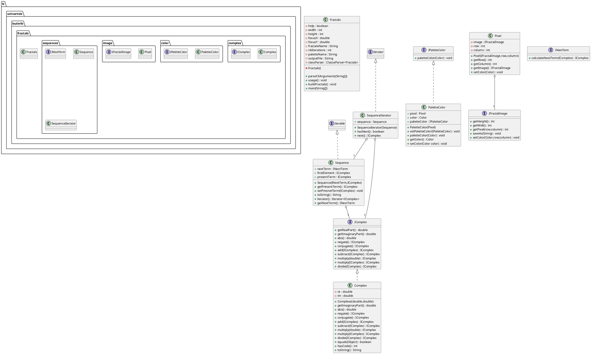

# Autour des Fractales

## Description

Ce projet fournit une implantation de base pour votre projet de SAÉ S3.A.01.
Pour pouvoir développer votre propre implantation de ce projet, vous devez
en créer une **divergence** en cliquant sur le bouton `Fork` en haut à droite
de cette page.

Lorsque ce sera fait, vous pourrez inviter les membres de votre groupe en tant
que *Developer* pour vous permettre de travailler ensemble sur ce projet.

## Exécution

Pour exécuter l'application, vous pouvez exécuter la tâche `run` de *Gradle*.
Afin de vous permettre de facilement contrôler la création des fractales depuis
la ligne de commande, la classe `fr.univartois.butinfo.fractals.Fractals` (qui
définit la méthode `main`) gère déjà pour vous les arguments de cette ligne
de commande (les options données sont stockées dans les attributs de cette
classe).
Vous pouvez en particulier l'exécuter à l'aide des options suivantes :

```
-f,--fractal-name  <name>      Spécifie le nom de la fractale à générer.
-h,--height        <pixels>    Spécifie la hauteur de l'image à générer.
-n,--nb-iterations <integer>   Spécifie le nombre d'itérations à appliquer pour générer la fractale.
-o,--output        <file>      Spécifie le nom du fichier dans lequel la fractale doit être sauvegardée.
-p,--palette-name  <name>      Spécifie le nom de la palette de couleurs à appliquer lors de la génération.
-s,--scale         <ratio>     Spécifie l'échelle à appliquer sur l'image.
-w,--width         <pixels>    Spécifie la largeur de l'image à générer.
-x,--focus-x       <real>      Spécifie le point central de l'image sur l'axe des abscisses.
-y,--focus-y       <real>      Spécifie le point central de l'image sur l'axe des ordonnées.
```

Évidemment, vous devrez compléter la classe `Fractals` pour qu'il se passe
quelque chose lors de l'exécution !

## JAR exécutable

Vous avez également la possibilité de générer un JAR à l'aide de *Gradle*, en
exécutant la tâche `jar`.
Ce JAR constitue un exécutable que vous pouvez facilement distribuer, et que
vous pouvez exécuter de la manière suivante :

```bash
java -jar build/libs/sae-2022-2023.jar --help
```

Les options acceptées par ce JAR sont les mêmes que celles décrites dans la
section précédente.

## To do 
- Le code source de votre bibliothèque sur GitLab, dont vous déposerez le lien sur Moodle.
- Le diagramme de classes de votre application, à la racine de votre dépôt GitLab, idéalement en
intégrant dans le README de votre projet un diagramme PlantUML.
- Différents scripts permettant d’exécuter votre application, que vous ajouterez dans un répertoire
scripts à la racine de votre dépôt GitLab (voir la section dédiée plus loin).
- Un rapport (au format Markdown) décrivant le travail réalisé par chacun, ainsi que la justification
du choix des patrons de conception et des structures de données utilisées. Vous y indiquerez
également en quoi les différentes ressources de votre formation vous ont aidés à réaliser ce
projet, et les difficultés que vous avez rencontrées pendant son développement. Ce rapport
devra également être ajouté à la racine de votre dépôt GitLab.

## Diagramme UML



## Rapport

Chaque sous-partie est ordonné par jours.

### Description du travail réalisé.

*Lundi 24 octobre 2022.*

- Sébastien a réalisé la partie sur la généralités des listes.
- Théo a réalisé la partie du choix des couleurs et a mis à jour le diagramme UML.
- Shahin a implémenter les opérations pour les nombres complexes.

### Justification de nos choix.

*Lundi 24 octobre 2022.*

- Sébastien a choisi de prendre, pour la représentation d'une suite, une stratégie *strategy* car elle permet de rendre interchangeables des algorithmes ayant des rôles similaires. Effectivement, les suites sont toutes pareils, sauf au niveau du calcul du prochain terme.
- Théo a choisi de prendre une stratégie *strategy* pour gérer le choix des palettes. Il a choisi de faire un composite pour traiter les élément de la classe `java.awt.color`.

### Comment la formation nous a aidé ?

*Lundi 24 octobre 2022.*

Sébastien et Théo ont su faire le choix du patron de conception grâce à la ressource de qualité de développement.

### Difficultés rencontrées

*Lundi 24 octobre 2022.*

- Sébastien a eu des difficultés à trouver le patron de conception. En effet, il pensait, au début, qu'il fallait faire un constructeur abstrait. Il a aussi eu des difficultés pour la création de l'Itérateur *Iterator*.
- Théo a eu des difficultés à trouver les patron de conception. Effectivement, il ne pensait pas du tout à faire une stratégie *strategy* mais à faire un singleton ou un proxy.